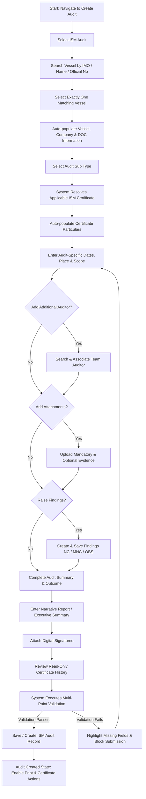
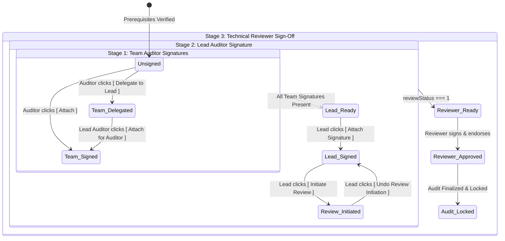
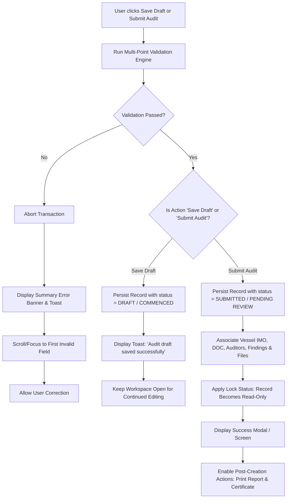
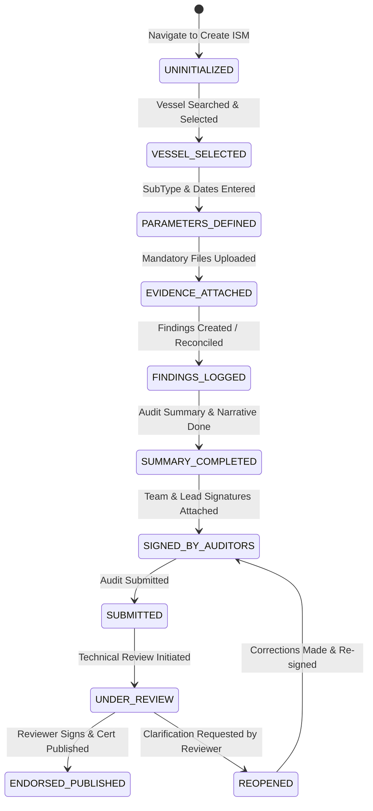

# Republic of the Marshall Islands (RMI) Maritime Administrator
# IRI Audit Application — Create ISM Audit: Complete User Flow Specification

---

## Document Overview
This document specifies the end-to-end **User Flow**, **Interaction Logic**, **Data Dependencies**, **State Transitions**, and **Validation Rules** for the **"Create ISM Audit"** process within the IRI Maritime Audit Application.

> **Scope Constraint:** This specification focuses strictly on the business flow, interaction logic, data dependencies, and navigation states for **Audit → ISM Audit**. It adheres strictly to the existing Marshall Islands maritime regulatory business rules and legacy screenshots while avoiding visual layout redesign.

---

## 1. Primary End-to-End User Flow (Happy Path)



---

## 2. Data Ownership Architecture

To prevent redundant manual data entry and maintain data integrity with official Flag State registry databases, data is strictly separated into **Auto-Populated Master Data** and **User-Entered Audit Data**.

| Category | Data Field | Source / Origin | Mutability in Audit Flow |
| :--- | :--- | :--- | :--- |
| **Vessel Master Data** | Vessel Name | RMI Vessel Registry | **Read-Only** (Auto-populated) |
| **Vessel Master Data** | IMO Number | RMI Vessel Registry | **Read-Only** (Auto-populated) |
| **Vessel Master Data** | Vessel Type | RMI Vessel Registry | **Read-Only** (Auto-populated) |
| **Vessel Master Data** | Official Number | RMI Vessel Registry | **Read-Only** (Auto-populated) |
| **Vessel Master Data** | Gross Tonnage - GRT (MT) | RMI Vessel Registry | **Read-Only** (Auto-populated) |
| **Company Master Data** | Company Name & Address | DOC Master Database | **Read-Only** (Auto-populated) |
| **Company Master Data** | Company IMO Number | DOC Master Database | **Read-Only** (Auto-populated) |
| **Company Master Data** | DOC Type (Full Term / Interim) | DOC Master Database | **Read-Only** (Auto-populated) |
| **Company Master Data** | DOC Issuer (e.g. Class Society) | DOC Master Database | **Read-Only** (Auto-populated) |
| **Company Master Data** | DOC Expiry Date | DOC Master Database | **Read-Only** (Auto-populated) |
| **Certificate Master Data** | Certificate Number (SMC) | Statutory Certificate DB | **Read-Only** (Resolved via Vessel + Subtype) |
| **Certificate Master Data** | Certificate Issued Type | Statutory Certificate DB | **Read-Only** (Auto-populated) |
| **Certificate Master Data** | Certificate Issue Date | Statutory Certificate DB | **Read-Only** (Auto-populated) |
| **Certificate Master Data** | Certificate Expiry Date | Statutory Certificate DB | **Read-Only** (Auto-populated) |
| **User / Session Data** | Auditor Name | Active Authenticated Session | **Auto-populated** (Default to Logged-in Auditor) |
| **User / Session Data** | Auditor ID | Active Authenticated Session | **Auto-populated** (System Inspector ID) |
| **System Generated** | Audit Report Number | System Sequence Generator | **Auto-populated** (`ISM-YYYY-XXXX`) |
| **Audit-Specific Data** | Audit Sub Type | User Selection | **User-Entered** (Dropdown) |
| **Audit-Specific Data** | Audit Scope (Full / Half) | User Selection | **User-Entered** (Dropdown) |
| **Audit-Specific Data** | Audit Date | User Selection | **User-Entered** (Date picker, defaults to today) |
| **Audit-Specific Data** | Audit Place (Port/City) | User Input | **User-Entered** (Searchable text) |
| **Audit-Specific Data** | Internal Audit Date | User Input | **User-Entered** (Date picker) |
| **Audit-Specific Data** | Opening Meeting Date/Time | User Input | **User-Entered** (24h DateTime picker) |
| **Audit-Specific Data** | Closing Meeting Date/Time | User Input | **User-Entered** (24h DateTime picker) |
| **Audit-Specific Data** | Credit Date | User Input | **User-Entered** (Optional date picker) |
| **Audit-Specific Data** | Additional Auditor Assignments | User Selection | **User-Entered** (Lookup modal) |
| **Audit-Specific Data** | Attachments & Evidence | User File Upload | **User-Entered** (Categorized uploads) |
| **Audit-Specific Data** | Audit Findings | User Creation | **User-Entered** (Findings wizard) |
| **Audit-Specific Data** | Audit Summary Outcome | User Selection | **User-Entered** (Mutually exclusive radio options) |
| **Audit-Specific Data** | Narrative Report Content | User Input | **User-Entered** (Rich-text summary) |
| **Audit-Specific Data** | Digital Signatures | User Action | **User-Entered** (Digital signature attachment) |
| **Historical Data** | Prior Audit / Certificate Logs | Audit History Database | **Read-Only** (Informational reference only) |

---

## 3. Step-by-Step Detailed Interaction Logic & Flow

### Step 1: Start Create ISM Audit
* **Entry Point / Navigation:**
  * Global Header / Dashboard Navigation: `Create` → `Audit` → `ISM Audit`
  * Or Global Sidebar Navigation: `Audit / Inspection / Review Creation` → `Audit` → `ISM Audit`
* **Pre-condition:** User is authenticated as an authorized Flag State Auditor or Technical Reviewer.
* **System Action:**
  * Initializes the `Create ISM Audit` workflow workspace.
  * Checks user session and initializes Auditor Name and Auditor ID.
  * Renders the form in an **uninitialized / locked state** awaiting Vessel selection.
  * Sets the primary user focus directly to the **Vessel Search** component.
* **Guardrail:** The audit creation form fields remain disabled or inert until a vessel is selected.

---

### Step 2: Search / Select Vessel
* **User Goal:** Establish the vessel registry identity for the audit.
* **Search Modes Supported:**
  1. `IMO Number` (7 digits, e.g., `9868778`, `9400679`)
  2. `Vessel Name` (text search, minimum 3 characters, e.g., `CLEAR STARS`, `LUCKY CARRIER`)
  3. `Official Number / Vessel ID` (4–5 digits, e.g., `8656`, `3712`)
* **Interaction Sequence:**
  ```mermaid
  sequenceDiagram
      autonumber
      actor User
      participant UI as Create ISM UI
      participant DB as Vessel Registry DB
      User->>UI: Selects Search Criterion (e.g. IMO Number)
      User->>UI: Inputs query string & triggers search (Enter / Click Search)
      UI->>UI: Validates input format (7 digits for IMO, >=3 chars for Name)
      alt Invalid format
          UI-->>User: Inline warning: "Please enter valid 7-digit IMO Number"
      else Valid format
          UI->>DB: Query Vessel Registry
          alt No records found
              DB-->>UI: 0 matches
              UI-->>User: Alert: "No vessel found matching criteria. Verify input."
          else Exactly 1 match found
              DB-->>UI: 1 matching record
              UI-->>User: Display match with green verified indicator
              UI->>UI: Trigger Step 3 (Load Vessel Information)
          else Multiple matches found
              DB-->>UI: Array of candidate vessels
              UI-->>User: Display Candidate Selection Modal / Dropdown List
              User->>UI: Selects exactly one vessel
              UI->>UI: Trigger Step 3 (Load Vessel Information)
          end
      end
  ```
* **Business Rule:** Exactly one vessel must be selected. The user cannot proceed to audit particulars without an active vessel binding.

---

### Step 3: Load Vessel Information (Auto-Population)
* **Trigger:** Exact vessel selected from Step 2.
* **System Action:**
  * Queries Vessel Master Record and associated Document of Compliance (DOC) records.
  * Automatically populates the following locked/read-only fields in the `VESSEL / COMPANY` section:
    * `Vessel Name` (e.g., *CLEAR STARS*)
    * `IMO Number` (e.g., *9868778*)
    * `Vessel Type` (e.g., *Oil tanker*)
    * `Official Number` (e.g., *8656*)
    * `GRT (MT)` (e.g., *61060*)
    * `Name / Address of Company` (DOC Holder corporate name & address)
    * `Company IMO Number` (e.g., *1631127*)
    * `DOC Type` (e.g., *Full Term*)
    * `DOC Issuer` (e.g., *Lloyd's Register*)
    * `DOC Expiry` (e.g., *31-May-2027*)
* **Data Ownership Rule:** All fields populated from the master database are marked **read-only** with lock icons. The user is prevented from manual text overwrites.
* **State Transition:** Vessel status moves to `VESSEL_SELECTED`. Form unlocks the `AUDIT / CERTIFICATE` section.

---

### Step 4: Select Audit Sub Type
* **User Action:** Selects `Audit Sub Type` from dropdown menu.
* **Available Options & Business Rules:**
  * `INITIAL`: For vessels entering the RMI registry or undergoing first full-term certification.
  * `INTERIM`: For newly built vessels, change of flag, or change of managing company (valid up to 6 months).
  * `INTERMEDIATE`: Conducted between the 2nd and 3rd anniversary dates of a Full Term SMC.
  * `RENEWAL`: Conducted prior to expiry of a Full Term SMC (typically every 5 years).
  * `ADDITIONAL`: Follow-up verification resulting from major non-conformities or Flag State intervention.
* **Dynamic Availability Logic:**
  * System cross-references the vessel's current certificate standing:
    * If the vessel holds an active Full Term SMC, `INITIAL` and `INTERIM` are disabled (greyed out), while `INTERMEDIATE`, `RENEWAL`, and `ADDITIONAL` are selectable.
    * If the vessel has no prior certificate, `INITIAL` or `INTERIM` must be selected.
* **Downstream Dependency:** The selection of `Audit Sub Type` immediately triggers Step 5 (Retrieve Certificate Information) and dictates the scope of the verification checklist.

---

### Step 5: Retrieve Certificate Information
* **Composite Query Key:** `Selected Vessel (IMO)` + `Selected Audit Sub Type`
* **System Action:**
  * Queries Statutory Certificate Registry to resolve the applicable Safety Management Certificate (SMC).
  * Auto-populates:
    * `Certificate No.` (e.g., *SMC-MHL-2026-1049*)
    * `Certificate Issued` (e.g., *Full Term*, *Interim SMC*, *Intermediate Endorsed*)
    * `Issue Date` (e.g., *21-Sep-2021*)
    * `Expiry Date` (e.g., *20-Sep-2026*)
* **Exception Handling Flow:**
  ```mermaid
  graph TD
      A[Query Certificate Registry by IMO + SubType] --> B{Certificate Record Found?}
      B -- Yes --> C[Auto-populate Certificate No, Type, Dates]
      C --> D[Mark Certificate as Verified]
      B -- No --> E{Is SubType INITIAL or INTERIM?}
      E -- Yes --> F[Certificate No marked: 'To Be Issued Upon Approval']
      F --> G[Display Info: 'New certification cycle initiated']
      E -- No --> H[Display Warning Banner: 'No active certificate found for selected SubType']
      H --> I[Highlight discrepancy & allow auditor to review Certificate History]
      I --> J[Block final submission until certificate discrepancy is resolved]
  ```
* **Critical Rule:** The system will **never** silently populate fallback/dummy certificate numbers. If no certificate exists, the state must be clearly communicated.

---

### Step 6: Enter Audit-Specific Information
* **User Goal:** Document the specific operational context and scheduling of this audit instance.
* **Auto-Populated Context (from Authenticated Session):**
  * `Auditor Name`: Pre-filled with logged-in user (e.g., *Edwin D*).
  * `Auditor ID`: Pre-filled with official inspector credential (e.g., *838*).
  * `Audit Report No.`: System-generated sequential identifier (e.g., *ISM-2026-0921*).
  * `Audit Status`: Initialized to `COMMENCED`.
* **User-Entered Fields:**
  * `Scope`: Select `Full Scope` (1000) or `Half Scope` (1001).
  * `Audit Date`: Date picker (defaults to current date, editable).
  * `Audit Place`: Free text / port selector (e.g., *Port of Singapore, SGP*).
  * `Internal Audit Date`: Date picker indicating when the operating company performed its mandatory internal audit under ISM Code Section 12.1.
  * `Opening Meeting Date & Time`: 24h DateTime picker.
  * `Closing Meeting Date & Time`: 24h DateTime picker.
  * `Credit Date`: Date picker (optional date for crediting audit against statutory anniversary window).
* **Validation & Chronological Rules:**
  * `Closing Meeting Date/Time` **must** be at least **1 hour** after `Opening Meeting Date/Time`.
  * Meeting dates must fall within or align directly with the `Audit Date`.
  * `Internal Audit Date` must precede the `Audit Date`.

---

### Step 7: Add Auditor (Multi-Auditor Team Workflow)
* **Context:** By default, the logged-in auditor is assigned as the **Lead Auditor**.
* **Trigger:** User clicks `[ Add Auditor ]` button in the header of the `AUDIT / CERTIFICATE` section.
* **Interaction Sequence:**
  1. Opens the **Auditor Search & Assignment Modal**.
  2. User searches by Auditor Name, Email, or Inspector ID.
  3. System returns matching certified Flag State auditors from the master directory.
  4. User selects an auditor and assigns a team role:
     * `Team Auditor`: Co-audits specific departments/shipboard areas.
     * `Co-Auditor / Trainee`: Observer or trainee.
     * `Make as Lead`: Prompts confirmation to transfer Lead Auditor status from current user to selected auditor.
  5. User clicks `[ Confirm Assignment ]`.
* **System Action:**
  * Appends auditor to the audit team roster (`auditors` array).
  * Creates a corresponding signature placeholder row in the `AUDITOR / REVIEWER SIGNATURE` section.
* **Data Ownership Rule:** Auditor IDs and credentials must be selected from system master records; manual freehand typing of arbitrary auditor IDs is prohibited.

---

### Step 8: Add Attachments (Document & Evidence Management)
* **Trigger:** User clicks `[ Add Attachment ]` in `ATTACHMENT TO THIS REPORT` section.
* **System Action:** Opens the **Audit Attachments Modal**.
* **Document Classifications & Requirements:**

| Document Type | Mandatory / Optional | Description |
| :--- | :--- | :--- |
| `AUDIT PLAN` | **Mandatory (*)** | Formal schedule and audit scope distributed to vessel master |
| `ATTENDANCE LIST` | **Mandatory (*)** | Signed opening and closing meeting attendance record |
| `CERTIFICATE` | Optional | Copies of existing SMC, DOC, or interim endorsements |
| `NON-CONFORMITY REPORT (NCR)` | Conditional | Mandatory if any Non-Conformity (NC/MNC) is logged |
| `CREW / MANNING LIST` | Optional | Minimum Safe Manning document verification copy |
| `OTHER EVIDENCE / PHOTOS` | Optional | Photographic or documentary evidence supporting findings |

* **Attachment Row Interactions:**
  * `Paperclip Icon`: Launches native file picker (supported: PDF, DOCX, JPEG, TIFF; max 25 MB).
  * `Types Dropdown`: Assigns document category.
  * `Comments Input`: Auditor contextual notes regarding the file.
  * `Trash Icon`: Removes row before final upload.
  * `(+) Floating Add Button`: Appends additional file rows.
  * `[ ADD ] / [ Save Attachments ]`: Commits uploads to the current audit session.
* **Status Updates:**
  * Section header updates KPI pill (e.g., `2 of 2 Mandatory Filed`).
  * Uploaded files display filename, category tag, upload timestamp, and actions: `[ Preview ]`, `[ Download ]`, `[ Replace ]`, `[ Delete ]`.
* **Guardrail:** Missing mandatory attachments will trigger a hard block during Step 14 (Validation).

---

### Step 9: Complete Audit Summary
* **Trigger:** User expands or navigates to the `AUDIT SUMMARY` section.
* **Context Statement:**
  > *"The undersigned has carried out the above audit according to the ISM Code and found the vessel:"*
* **Mutually Exclusive Outcome Options (Radio Selection):**
  1. `Option 1`: **Clean Compliance**
     * *"Is in compliance with the requirements of the ISM Code (auditSubType)"*
     * Valid only if **zero** Non-Conformities (NC/MNC) are raised.
  2. `Option 2`: **Compliance with Corrective Action Plan (CAP)**
     * *"Is in compliance with the requirements of the ISM Code (auditSubType), Non-Conformity issued and corrective action plan shall be submitted by [DD/MMM/YYYY]"*
     * Automatically populated with the earliest CAP due date from logged findings.
  3. `Option 3`: **Compliance with CAP + Additional Audit Required**
     * *"Is in compliance with the requirements of the ISM Code (auditSubType), Non-Conformity issued and corrective action plan shall be submitted by [DD/MMM/YYYY] and Additional audit to be completed by [DD/MMM/YYYY]"*
     * Requires specification of both CAP due date and follow-up additional audit deadline.
  4. `Option 4`: **Interim Compliance**
     * *"Is in compliance with the provisions of Section 14.0, Part B of the ISM Code (for Interim Audit)"*
     * Valid only when `Audit Sub Type === INTERIM`.
  5. `Option 5`: **Not Approved / Suspended**
     * *"Not approved, the audit was temporarily suspended due to the reasons stated in the Narrative report"*
     * Marks audit as suspended; forces mandatory explanation in Narrative Summary.
* **Role Permission:** Only the Lead Auditor (`isLeadAuditor === true`) can select or modify the Audit Summary outcome. Other users see this section in a read-only state.

---

### Step 10: Create Findings (Findings Workflow)
* **Trigger:** User clicks `[ New Finding ]` in the persistent bottom action bar.
* **Interaction Sequence:**
  ```mermaid
  sequenceDiagram
      autonumber
      actor Auditor
      participant Bar as Bottom Action Bar
      participant Wizard as Finding Modal / Form
      participant Audit as ISM Audit State
      Auditor->>Bar: Clicks [ New Finding ]
      Bar->>Wizard: Launches Finding Creation Form
      Wizard->>Wizard: Binds Current Vessel IMO & Audit Report No
      Auditor->>Wizard: Selects Finding Category (MNC / NC / OBS)
      Auditor->>Wizard: Selects ISM Code Element (e.g. Chapter 6 - Resources)
      Auditor->>Wizard: Enters Objective Evidence / Statement of Fact
      Auditor->>Wizard: Enters Corrective Action Requirement (CAR)
      Auditor->>Wizard: Sets CAP Submission Due Date & Target Closure Date
      Auditor->>Wizard: Clicks [ Save Finding ]
      Wizard->>Audit: Commit Finding to Audit Record
      Audit->>Audit: Recalculate Finding Counters (MNC, NC, OBS)
      Audit->>Audit: Auto-update Audit Summary CAP Due Date
      Audit-->>Auditor: Return to ISM Audit Workspace with updated Finding List
  ```
* **Findings Classification Rules:**
  * **Major Non-Conformity (MNC):** An identifiable deviation that poses a serious threat to ship safety or personnel or immediate risk to environment. Precludes certificate issuance/endorsement until downgraded or resolved.
  * **Non-Conformity (NC):** An observed situation where objective evidence indicates the non-fulfilment of a specified requirement. Requires approved CAP within 30 days.
  * **Observation (OBS):** A statement of fact made during an audit substantiated by objective evidence.
* **Finding Navigation:** Users can browse through logged findings using `[ Previous Finding ]` and `[ Next Finding ]` buttons.

---

### Step 11: Auditor / Reviewer Signature Workflow
* **Trigger:** User navigates to `AUDITOR / REVIEWER SIGNATURE` section.
* **Role-Based Progressive Signing Protocol:**



* **Signature Execution Logic:**
  * `[ Attach ]`: Attaches the user's stored Base64 cryptographic digital signature with system date/time stamp.
  * `[ Remove ]`: Clears signature (available only before review initiation).
  * `[ Delegate ]`: Allows team auditor unable to digitally sign in the field to delegate signing authority to the Lead Auditor.
* **Guardrail:** The Lead Auditor **cannot** sign until all team auditors have either signed or formally delegated their signature.

---

### Step 12: Narrative Report / Summary
* **Trigger:** User expands `NARRATIVE REPORT / SUMMARY`.
* **Purpose:** Provides a comprehensive qualitative evaluation of the vessel's Safety Management System (SMS).
* **Content Structure:**
  * Executive Overview of Audit Scope.
  * Summary of Opening & Closing Meetings (attendees, dates, master's cooperation).
  * SMS Implementation & Verification (documentation control, emergency drills observed, maintenance compliance).
  * Overview of Non-Conformities & Observations.
  * Recommendations to Flag State Administration.
* **Validation Rule:** The Narrative Report **cannot be empty** or contain only whitespace/empty HTML tags (`<p><br></p>`). A valid narrative is mandatory for signature validation.

---

### Step 13: Certificate History
* **Trigger:** User expands `CERTIFICATE HISTORY`.
* **System Action:** Retrieves historical statutory records for the active vessel.
* **Information Displayed:**
  * Prior Safety Management Certificates (SMC Number, Type, Issue Date, Expiry Date).
  * Prior Audit Reports (Audit Type, Audit Date, Lead Auditor, Finding Totals).
  * Intermediate / Annual Endorsement logs.
* **Data Ownership Rule:** This section is **strictly read-only and informational**. It provides audit continuity context without permitting inline edits to historical logs.

---

### Step 14: Multi-Point Validation Engine
* **Execution Trigger:** Automatically evaluated when:
  * User attempts to navigate between major milestones.
  * User clicks `[ Save Draft ]`.
  * User clicks `[ Submit Audit ]`.
  * User attempts to attach the Lead Auditor Signature.
* **Validation Rules Checklist:**

| Check # | Target Section | Validation Rule | Behavior on Failure |
| :--- | :--- | :--- | :--- |
| **V-01** | Vessel / Company | Exactly one registered vessel must be selected | Blocks progress; shows "Select a vessel first" |
| **V-02** | Audit / Certificate | `Audit Sub Type` must be selected | Highlights dropdown; "Audit Sub Type is mandatory" |
| **V-03** | Audit / Certificate | `Audit Date` and `Audit Place` must be filled | Highlights missing field; "Audit Date & Place required" |
| **V-04** | Audit / Certificate | `Opening Meeting` must be before `Closing Meeting` | "Closing meeting must be at least 1 hour after opening" |
| **V-05** | Attachments | Mandatory attachments (`AUDIT PLAN`, `ATTENDANCE LIST`) present | Red badge; "Mandatory attachments missing" |
| **V-06** | Findings & Summary | If findings exist, Summary cannot be "Clean Compliance" | "Summary outcome contradicts logged Non-Conformities" |
| **V-07** | Findings & Summary | CAP submission date must be provided if NCs exist | Highlights date field; "CAP submission date required" |
| **V-08** | Narrative Summary | Narrative Report text length > 0 | Highlights editor; "Narrative summary must be filled" |
| **V-09** | Signatures | Team signatures present before Lead Auditor signs | Disables Lead [ Attach ]; "Pending team auditor signatures" |

---

### Step 15: Save / Create Audit Execution



* **Successful Creation State:**
  * The audit report number is permanently committed.
  * Vessel, certificate, findings, and attachments are permanently linked.
  * Audit state updates to `COMMENCED` or `SUBMITTED`.
  * Persistent action bar enables `[ Print Report ]` and `[ Certificate ]`.
  * Lock indicator reflects active cryptographic seal.

---

## 4. State Transition Model

The lifecycle of an ISM Audit instance traverses the following formal system states:



| State Code | State Name | Description | Allowed Actions |
| :--- | :--- | :--- | :--- |
| `1000` | **UNINITIALIZED** | Empty creation form | Search & select vessel |
| `1001` | **VESSEL_SELECTED** | Vessel bound; particulars loaded | Select subtype, enter dates, add auditor |
| `1002` | **COMMENCED / DRAFT** | Audit parameters saved; in progress | Add attachments, log findings, edit narrative |
| `1003` | **VALIDATED** | All mandatory inputs complete | Attach auditor signatures |
| `1004` | **SUBMITTED** | Lead signed; audit submitted | View, Print Report, Initiate Technical Review |
| `1005` | **UNDER_REVIEW** | Under evaluation by Flag State Manager | Reviewer verification, Approve, Reopen |
| `1006` | **COMPLETED** | Fully approved and endorsed | Generate Certificate, Publish, Download |
| `1007` | **VOID / SUSPENDED** | Audit cancelled or suspended | View read-only audit log and justification |

---

## 5. Summary of Compliance with Architectural Boundaries

1. **Strictly Flow-Oriented:** This specification defines interactions, data flows, conditions, validations, and transitions without mandating visual cards, CSS rules, or layout styling.
2. **Data Ownership Respect:** Clearly demarcates system-owned registry records from auditor-entered field data.
3. **Legacy Parity:** Fully incorporates all 15 operational stages, error handlers, and business rules derived from the legacy application and reference screenshots.
4. **Scope Integrity:** Confined strictly to **Audit → ISM Audit** as requested.
